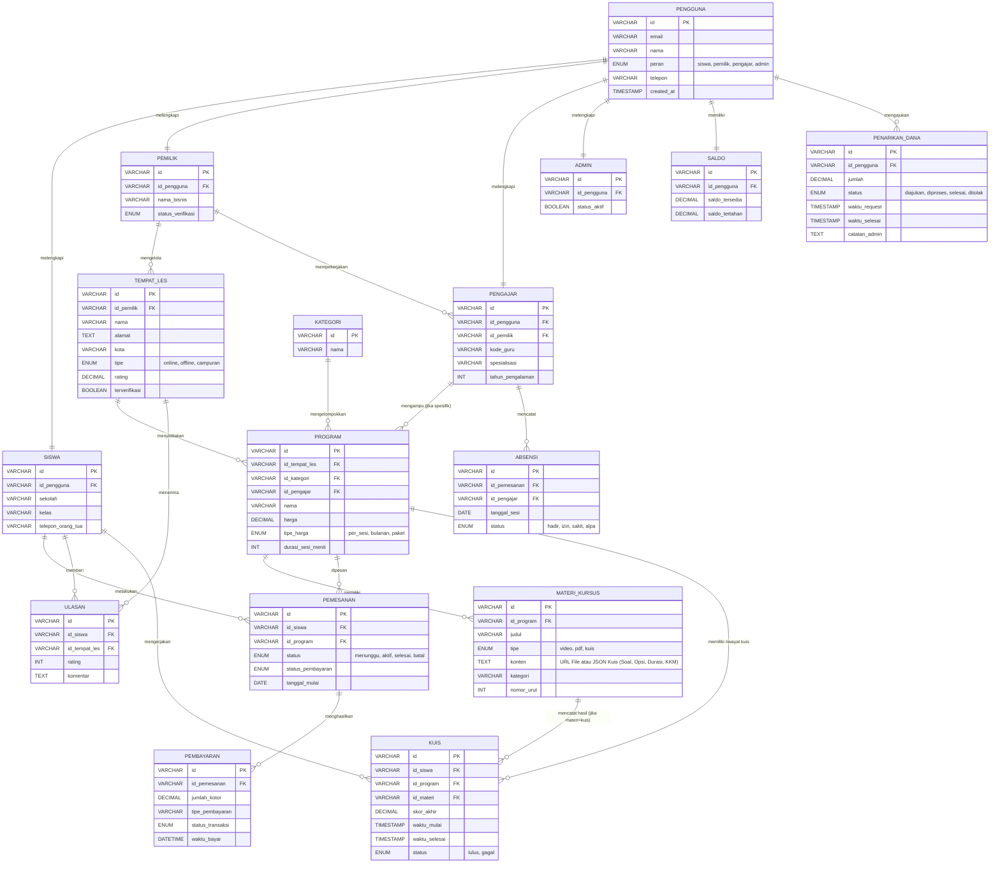

```mermaid
erDiagram

%% =================================================
%% LAPIS 1 : IDENTITAS PENGGUNA
%% =================================================
PENGGUNA {
    VARCHAR id PK
    VARCHAR email
    VARCHAR nama
    ENUM peran "siswa, pemilik, pengajar, admin"
    VARCHAR telepon
    TIMESTAMP created_at
}

SISWA {
    VARCHAR id PK
    VARCHAR id_pengguna FK
    VARCHAR sekolah
    VARCHAR kelas
    VARCHAR telepon_orang_tua
}

PEMILIK {
    VARCHAR id PK
    VARCHAR id_pengguna FK
    VARCHAR nama_bisnis
    ENUM status_verifikasi
}

PENGAJAR {
    VARCHAR id PK
    VARCHAR id_pengguna FK
    VARCHAR id_pemilik FK
    VARCHAR kode_guru
    VARCHAR spesialisasi
    INT tahun_pengalaman
}

ADMIN {
    VARCHAR id PK
    VARCHAR id_pengguna FK
    BOOLEAN status_aktif
}

%% =================================================
%% LAPIS 2 : STRUKTUR BISNIS
%% =================================================
TEMPAT_LES {
    VARCHAR id PK
    VARCHAR id_pemilik FK
    VARCHAR nama
    TEXT alamat
    VARCHAR kota
    ENUM tipe "online, offline, campuran"
    DECIMAL rating
    BOOLEAN terverifikasi
}

KATEGORI {
    VARCHAR id PK
    VARCHAR nama
}

PROGRAM {
    VARCHAR id PK
    VARCHAR id_tempat_les FK
    VARCHAR id_kategori FK
    VARCHAR id_pengajar FK 
    VARCHAR nama
    DECIMAL harga
    ENUM tipe_harga "per_sesi, bulanan, paket"
    INT durasi_sesi_menit
}

%% =================================================
%% LAPIS 3 : LMS (Learning Management System)
%% =================================================
MATERI_KURSUS {
    VARCHAR id PK
    VARCHAR id_program FK
    VARCHAR judul
    ENUM tipe "video, pdf, kuis"
    TEXT konten "URL File atau JSON Kuis (Soal, Opsi, Durasi, KKM)"
    VARCHAR kategori
    INT nomor_urut
}

%% =================================================
%% LAPIS 3.5 : QUIS (Simplified)
%% =================================================
KUIS {
    VARCHAR id PK
    VARCHAR id_siswa FK
    VARCHAR id_program FK 
    VARCHAR id_materi FK 
    DECIMAL skor_akhir
    TIMESTAMP waktu_mulai
    TIMESTAMP waktu_selesai
    ENUM status "lulus, gagal"
}

%% =================================================
%% LAPIS 4 : TRANSAKSI & OPERASIONAL
%% =================================================
PEMESANAN {
    VARCHAR id PK
    VARCHAR id_siswa FK
    VARCHAR id_program FK
    ENUM status "menunggu, aktif, selesai, batal"
    ENUM status_pembayaran
    DATE tanggal_mulai
}

PEMBAYARAN {
    VARCHAR id PK
    VARCHAR id_pemesanan FK
    DECIMAL jumlah_kotor
    VARCHAR tipe_pembayaran
    ENUM status_transaksi
    DATETIME waktu_bayar
}

ABSENSI {
    VARCHAR id PK
    VARCHAR id_pemesanan FK
    VARCHAR id_pengajar FK
    DATE tanggal_sesi
    ENUM status "hadir, izin, sakit, alpa"
}

ULASAN {
    VARCHAR id PK
    VARCHAR id_siswa FK
    VARCHAR id_tempat_les FK
    INT rating
    TEXT komentar
}

%% =================================================
%% LAPIS 5 : KEUANGAN
%% =================================================
SALDO {
    VARCHAR id PK
    VARCHAR id_pengguna FK
    DECIMAL saldo_tersedia
    DECIMAL saldo_tertahan
}

PENARIKAN_DANA {
    VARCHAR id PK
    VARCHAR id_pengguna FK
    DECIMAL jumlah
    ENUM status "diajukan, diproses, selesai, ditolak"
    TIMESTAMP waktu_request
    TIMESTAMP waktu_selesai
    TEXT catatan_admin
}

%% =================================================
%% RELASI UTAMA
%% =================================================
PENGGUNA ||--|| SISWA : melengkapi
PENGGUNA ||--|| PEMILIK : melengkapi
PENGGUNA ||--|| PENGAJAR : melengkapi
PENGGUNA ||--|| ADMIN : melengkapi

PEMILIK ||--o{ TEMPAT_LES : mengelola
PEMILIK ||--o{ PENGAJAR : mempekerjakan

TEMPAT_LES ||--o{ PROGRAM : menyediakan
KATEGORI ||--o{ PROGRAM : mengelompokkan
PENGAJAR ||--o{ PROGRAM : "mengampu (jika spesifik)"

PROGRAM ||--o{ MATERI_KURSUS : memiliki

SISWA ||--o{ PEMESANAN : melakukan
PROGRAM ||--o{ PEMESANAN : dipesan

PEMESANAN ||--o{ PEMBAYARAN : menghasilkan
PENGAJAR ||--o{ ABSENSI : mencatat

SISWA ||--o{ ULASAN : memberi
TEMPAT_LES ||--o{ ULASAN : menerima

PENGGUNA ||--|| SALDO : memiliki
PENGGUNA ||--o{ PENARIKAN_DANA : mengajukan

%% RELASI KUIS (SIMPLIFIED)
MATERI_KURSUS ||--o{ KUIS : "mencatat hasil (jika materi=kuis)"
PROGRAM ||--o{ KUIS : "memiliki riwayat kuis"
SISWA ||--o{ KUIS : "mengerjakan"

```
