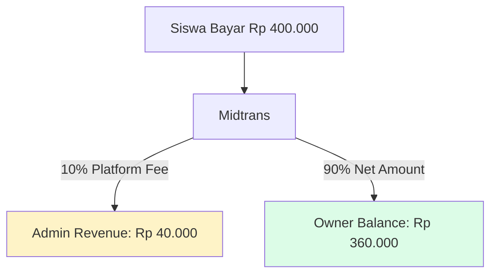
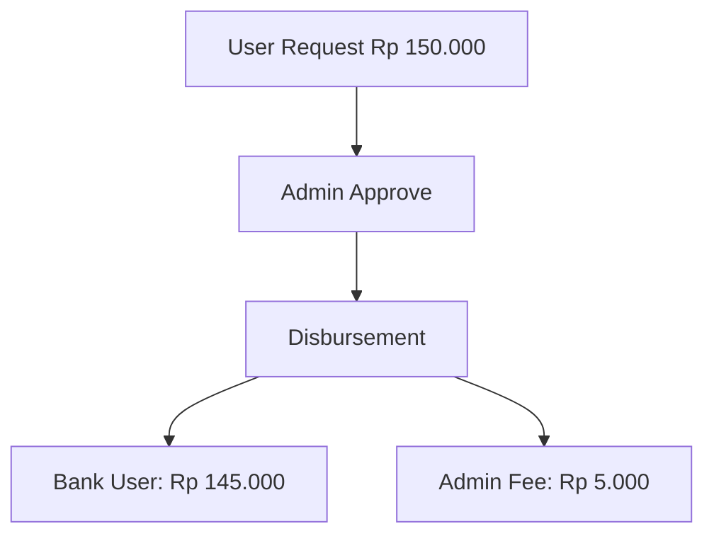
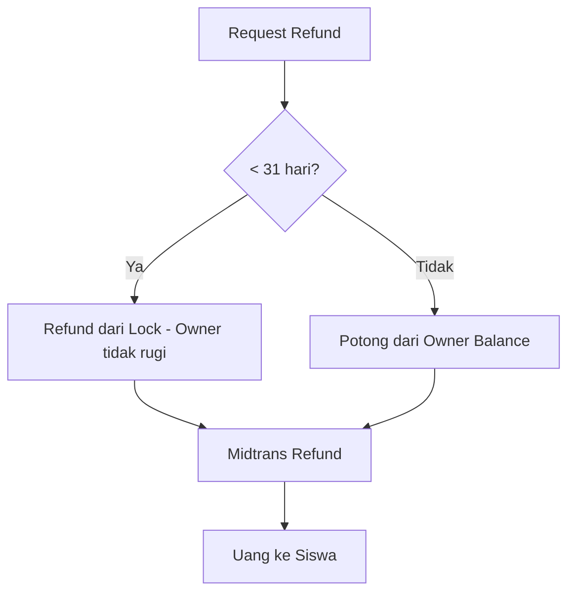

# Alur Uang Sistem Mariles

## Fee Structure

| Jenis Fee | Nominal | Ditanggung |
|-----------|---------|------------|
| **Platform Fee** | 10% dari pembayaran | Owner |
| **Withdrawal Fee** | Rp 5.000/transaksi | Owner/Teacher |
| **Midtrans Fee** | ~0.7-2.9% | Platform (terpisah) |

---

## Alur 1: Siswa Membeli Program

### Breakdown:
| Item | Nominal | Lokasi |
|------|---------|--------|
| Pembayaran Siswa | Rp 400.000 | Midtrans Balance |
| Platform Fee (10%) | Rp 40.000 | DB: `platform_revenue` |
| Net ke Owner (90%) | Rp 360.000 | DB: `balances` |

> **Note:** Fee Midtrans (~0.7%) dipotong terpisah oleh Midtrans, tidak mempengaruhi perhitungan di atas.

---

## Alur 2: Owner Bayar Gaji Guru

| Aksi | Owner Balance | Teacher Balance | Midtrans |
|------|---------------|-----------------|----------|
| Bayar gaji Rp 200.000 | -Rp 200.000 | +Rp 200.000 | Tidak berubah |

> ✅ **Internal transfer** - tidak melibatkan Midtrans.

---

## Alur 3: Withdrawal (Penarikan Dana)

### Breakdown:
| Item | Nominal |
|------|---------|
| Request withdraw | Rp 150.000 |
| Withdrawal fee | -Rp 5.000 |
| **Diterima di bank** | Rp 145.000 |

| Perubahan | DB Balance | Midtrans | Admin Revenue |
|-----------|------------|----------|---------------|
| Setelah withdraw | -Rp 150.000 | -Rp 145.000 | +Rp 5.000 |

---

## Alur 4: Refund

| Kondisi | Owner Balance | Midtrans |
|---------|---------------|----------|
| Dalam 31 hari | Tidak berubah | -Rp 400.000 |
| Setelah 31 hari | -Rp 360.000 | -Rp 400.000 |

---

## Summary: Lokasi Uang

| Tahap | Uang Fisik | Database |
|-------|-----------|----------|
| Siswa bayar | → Midtrans | `transactions`, `balances` |
| Gaji guru | Midtrans tetap | Transfer antar `balances` |
| Withdraw | Midtrans → Bank | `withdrawals`, `platform_revenue` |
| Refund | Midtrans → Siswa | `balances` berkurang |

---

## Contoh Lengkap (1 Transaksi)

| Step | Aksi | Owner | Admin | Midtrans |
|------|------|-------|-------|----------|
| 1 | Siswa bayar Rp 400.000 | +Rp 360.000 | +Rp 40.000 | +Rp 400.000 |
| 2 | Gaji guru Rp 200.000 | -Rp 200.000 | - | - |
| 3 | Withdraw Rp 150.000 | -Rp 150.000 | +Rp 5.000 | -Rp 145.000 |
| **Saldo Akhir** | | Rp 10.000 | Rp 45.000 | Rp 255.000 |
