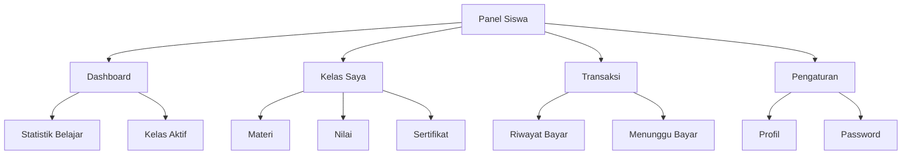
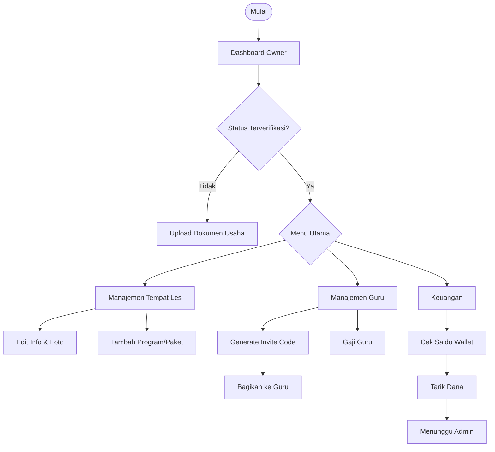
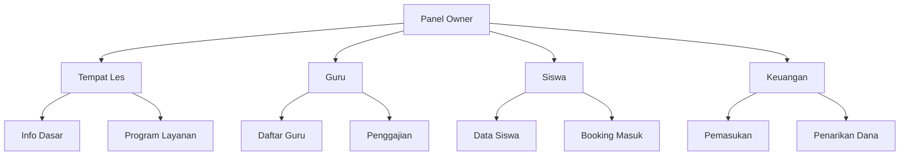
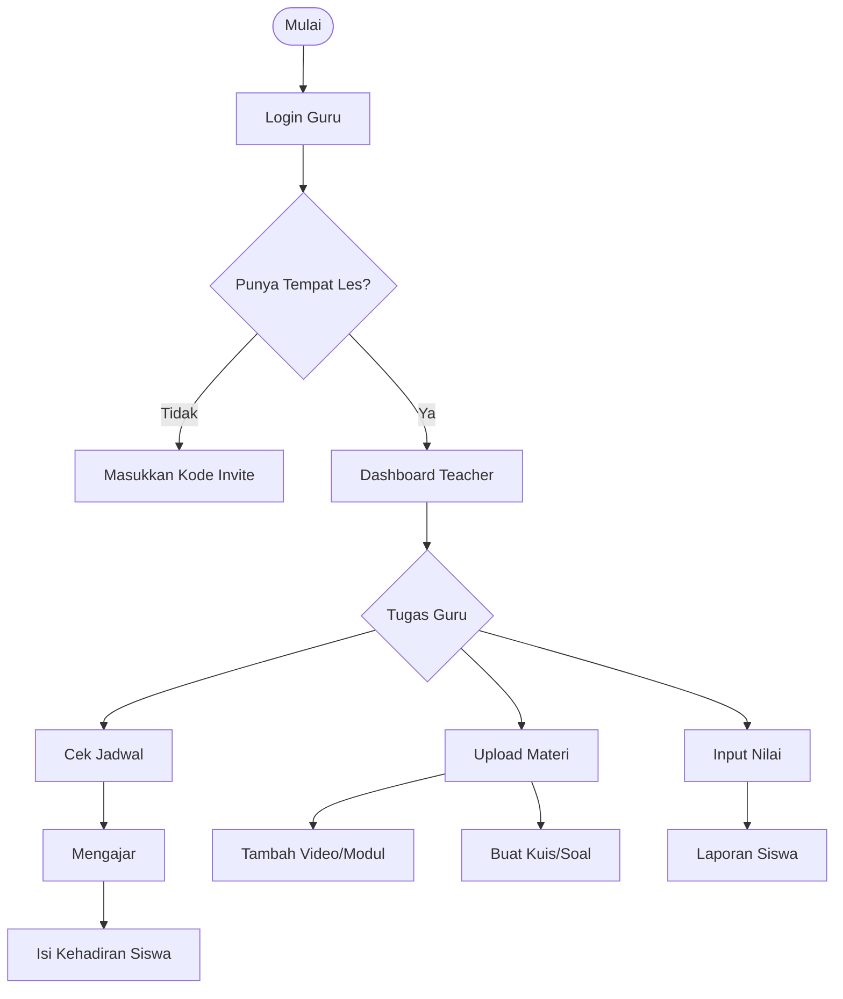
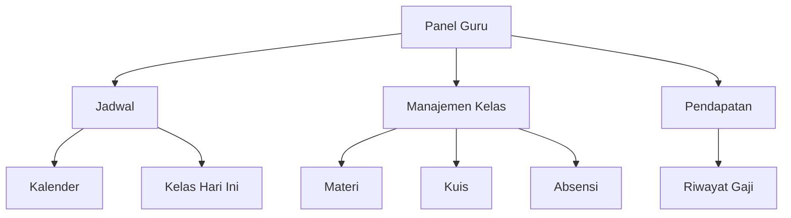
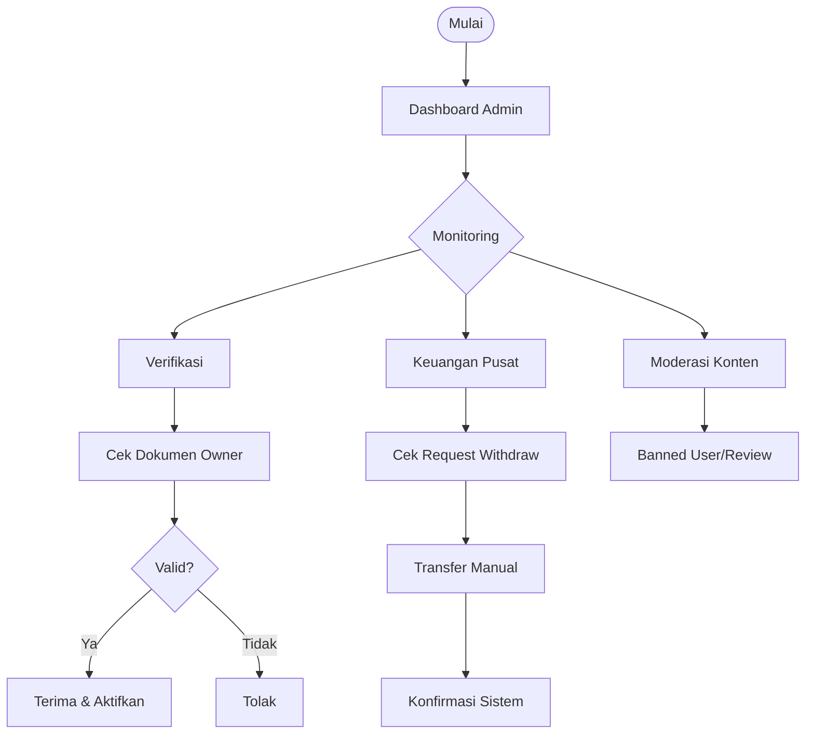
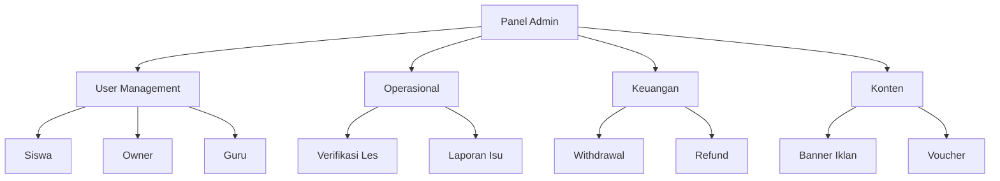

# Entity-Specific Diagrams

Berikut adalah diagram alur (Flowchart) dan struktur menu (Hierarchy) yang dipisahkan untuk setiap entitas pengguna.

---

## 1. STUDENT (Siswa)

### Flowchart: Alur Pembelajaran Siswa
```mermaid
flowchart TD
    Start([Mulai]) --> Dashboard[Dashboard Student]
    
    Dashboard --> Choice{Pilih Aksi}
    
    %% Cari Les
    Choice --> Search[Cari Tempat Les]
    Search --> Filter[Filter Kategori/Lokasi]
    Filter --> SelectLes[Pilih Les]
    SelectLes --> ViewDetail[Lihat Detail & Harga]
    ViewDetail --> Book{Booking?}
    Book -- Ya --> Payment[Pembayaran (Midtrans)]
    Payment --> Success{Berhasil?}
    Success -- Ya --> MyClass[Masuk ke Kelas Saya]
    
    %% Belajar
    Choice --> MyClassAccess[Akses Kelas Saya]
    MyClassAccess --> MatList[Lihat Materi]
    MatList --> Study[Belajar (Video/Modul)]
    Study --> Quiz[Kerjakan Kuis]
    Quiz --> Result[Lihat Hasil & Nilai]
    
    %% Lainnya
    Choice --> Forum[Akses Forum]
    Choice --> Profile[Edit Profil]
```

### Hierarchy Chart: Menu Siswa


---

## 2. OWNER (Pemilik Les)

### Flowchart: Alur Bisnis Owner


### Hierarchy Chart: Menu Owner


---

## 3. TEACHER (Guru)

### Flowchart: Alur Mengajar


### Hierarchy Chart: Menu Guru


---

## 4. ADMIN (Administrator)

### Flowchart: Alur Kontrol Admin


### Hierarchy Chart: Menu Admin

