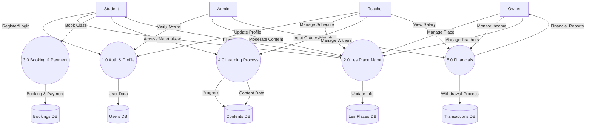

# System Diagrams - Mariles

## 1. Data Flow Diagram (DFD) Level 1



## 2. System Flowchart (Alur Utama)

```mermaid
flowchart TD
    Start([Start]) --> Login{Login?}
    
    Login -- No --> Register[Register Page]
    Register --> RoleChoice{Choose Role}
    
    RoleChoice -- Student --> StudentDash[Student Dashboard]
    RoleChoice -- Owner --> OwnerDash[Owner Dashboard]
    RoleChoice -- Teacher --> TeacherDash[Teacher Dashboard]
    RoleChoice -- Admin --> AdminDash[Admin Dashboard]
    
    Login -- Yes --> AuthCheck[Auth Check]
    AuthCheck --> RoleRedirect{Redirect by Role}
    
    %% Student Flow
    RoleRedirect -- Student --> StudentDash
    StudentDash --> Search[Search Les]
    Search --> ViewDetail[View Detail Les]
    ViewDetail --> Booking[Booking Class]
    Booking --> Payment[Payment (Midtrans)]
    Payment --> MyClass[My Class Access]
    MyClass --> Learning[Access Materials/Quiz]
    
    %% Owner Flow
    RoleRedirect -- Owner --> OwnerDash
    OwnerDash --> SetupProfile[Setup Profile/Bank]
    SetupProfile --> CreateLes[Create/Edit Les Place]
    CreateLes --> AddProgram[Add Programs]
    AddProgram --> ManageTrans[Manage Transactions]
    ManageTrans --> Withdraw[Withdraw Funds]
    
    %% Teacher Flow
    RoleRedirect -- Teacher --> TeacherDash
    TeacherDash --> UpdateAvail[Update Availability]
    TeacherDash --> ViewSchedule[View Schedule]
    ViewSchedule --> InputScore[Input Grades/Attendance]
    
    %% Admin Flow
    RoleRedirect -- Admin --> AdminDash
    AdminDash --> VerifyUser[Verify Owners/Places]
    VerifyUser --> ProcessFunds[Process Withdrawals]
```

## 3. Hierarchy Chart (Struktur Menu)

```mermaid
graph TD
    Main[Mariles App]
    
    %% Level 1 public
    Main --> Public[Public/Guest]
    Public --> Home
    Public --> Search
    Public --> Login
    Public --> Register
    
    %% Level 1 Student
    Main --> Student[Student Panel]
    Student --> S_Dash[Dashboard]
    Student --> S_MyClass[Kelas Saya]
    Student --> S_Trans[Transaksi]
    Student --> S_Forum[Forum]
    Student --> S_Profile[Profile]
    
    %% Level 1 Owner
    Main --> Owner[Owner Panel]
    Owner --> O_Dash[Dashboard]
    Owner --> O_Les[Manajemen Les]
    Owner --> O_Prog[Program/Paket]
    Owner --> O_Fin[Keuangan]
    Owner --> O_Teach[Guru]
    
    %% Level 1 Teacher
    Main --> Teacher[Teacher Panel]
    Teacher --> T_Dash[Dashboard]
    Teacher --> T_Sched[Jadwal Mengajar]
    Teacher --> T_Mat[Materi & Kuis]
    Teacher --> T_Stud[Data Siswa]
    
    %% Level 1 Admin
    Main --> Admin[Admin Panel]
    Admin --> A_User[Users Mgmt]
    Admin --> A_Verif[Verifikasi]
    Admin --> A_Fin[Keuangan Pusat]
    Admin --> A_Rep[Laporan/Isu]
```


